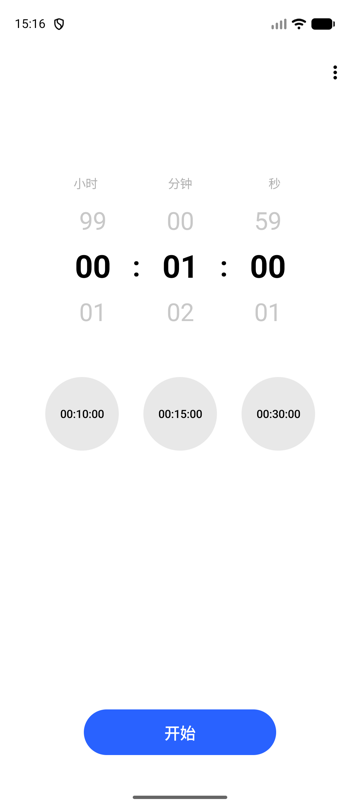

# 倒计时器

简洁风格的 Android 倒计时 App（Jetpack Compose）。



## 功能

- 时 / 分 / 秒循环滚轮选择（小时 0–99，分秒 0–59）
- 快捷预设：10 / 15 / 30 分钟
- 开始、暂停、继续、取消
- 结束后震动与提示音

## 要求

- Android Studio / Android CLI
- minSdk 26，targetSdk 36

## 构建运行

```bash
./gradlew :app:assembleDebug
android run --device=<device-id> --apks=app/build/outputs/apk/debug/app-debug.apk
```
